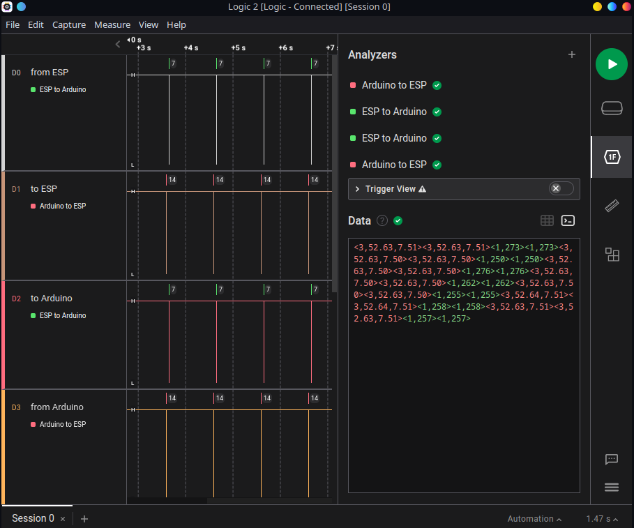
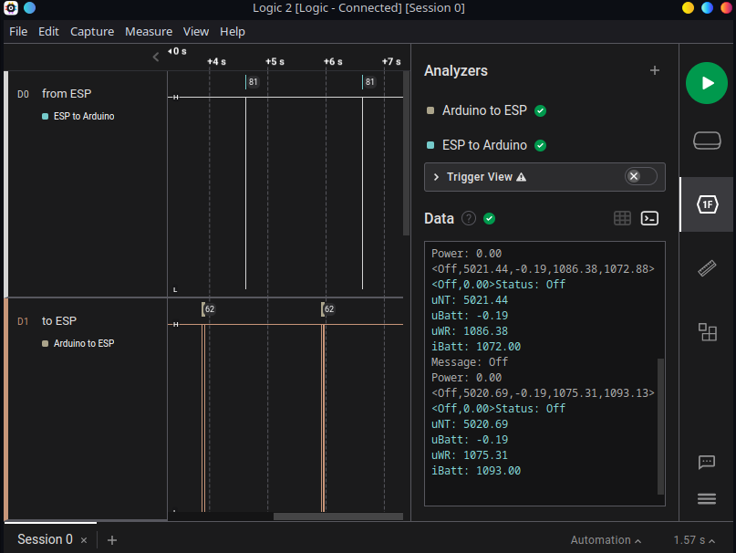

# Energiewürfel

## Masterarbeit Smart-Home Batteriespeicher für Balkonkraftwerke

- ### Architektur

    Es wird ein Kombiboard aus einem Arduino Uno und einem ESP8266 benutzt, welche über UART Befehle und Messdaten austauschen.

    - [Arduino (Arduino_Code)](https://github.com/PaulusElektrus/EnergyCube-Arduino)

        Der Arduino übernimmt die Steuerung der Hardware

    - [ESP8266 (ESP_code)](https://github.com/PaulusElektrus/EnergyCube-ESP)

        Der ESP8266 mit seinem W-LAN Modul übernimmt die Kommunikation mit dem Internet

- ### Kommunikation

    Die Kommunikation zwischen den Mikrocontrollern erfolgt über UART. 

    #### - Test 2

    Die Kommunikation läuft in Version 1.0 nach folgenden Regeln ab:

        1) Der Arduino sendet eine Anfrage an den ESP mit seinem aktuellen Status und der aktuellen Batterie Spannung / Strom
        2) Der ESP antwortet darauf mit einem Befehl und der aktuellen Haushaltsleistung der Shelly
    
    

    #### - Test 1

    Ein Screenshot des Logic Analyzers welchen ich zur Überwachung der Kommunikation benutze:

    
    
    Man erkennt in den < > geschweiften Klammern die jeweils übertragene Nachricht und danach als Empfangsbestätigung (auch als Debug und zu Demonstrationszwecken verwendet) die Ausgabe des jeweiligen Mikrocontrollers im richtigen Datenformat mit Vorzeichen.

- ### Statusbefehle

    - from ESP to Arduino
        - 0 = Off
        - 1 = Charging possible (after sunrise)
        - 2 = Discharging possible (after sunset)

    - from Arduino to ESP
        - 0 = Off
        - 1 = Charging
        - 2 = Discharging
        - 3 = Failure

    - Außerdem:
        - Charging = negative Power & Ampere
        - Discharging = positive Power & Ampere

- ### Weitere Informationen folgen...